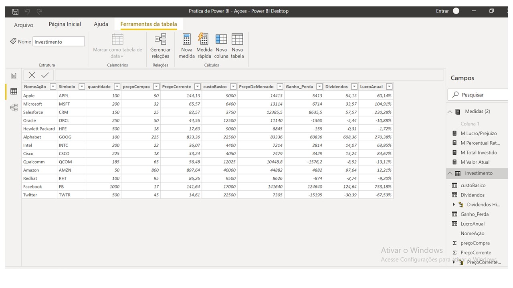
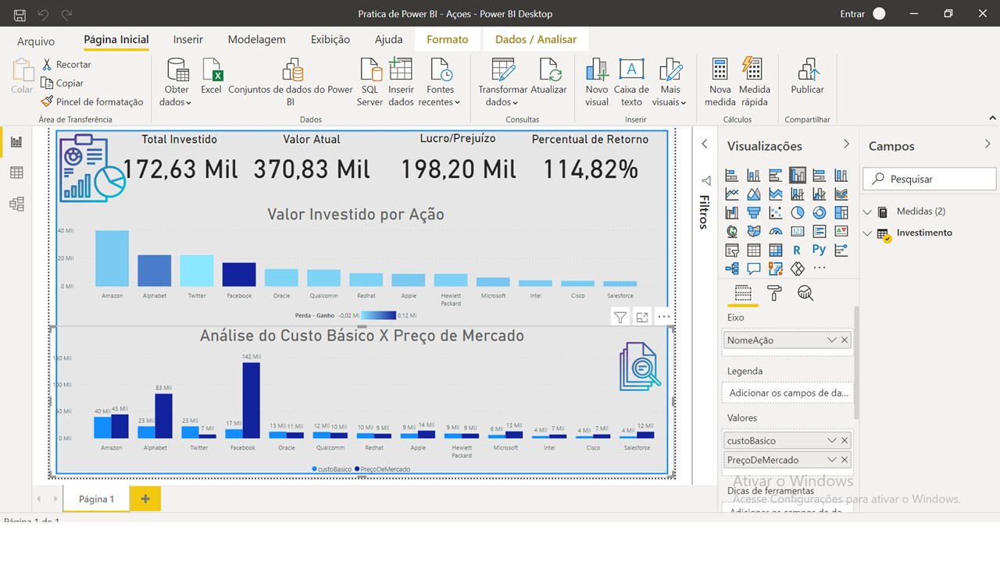

<h1><b> Power-BI-projetos </b> </h1>

<h2>Projeto de Power BI feito com base em dados abstratos de Ações Internacionais.</h2>
<h2>Screenshots</h2>

<h4><b>Situação do projeto: </b></h4>
  
Foi realizada a coleta de dados de ações de algumas empresas internacionais de um período antes e depois do aporte feito pelos clientes. Determinado dia, houve um pedido da empresa  relatando que o  cliente "X"  desejaria verificar a situação atual das ações que ele investiu. Como colaborador, a responsabilidade de montar o Dashboard mostrando os dados financeiros ficou ao seu critério.

 <ul>O dashboard foi montado mostrando: 
 <li> Aplicação de recursos iniciais em ações;</li>
 <li> Valor atual das ações;</li>
 <li> Lucro obtido;</li>
 <li> Percentual de retorno financeiro positvo/negativo;</li>
 <li> Graficos de aplicacao de recursos entre as ações; </li>
 <li> Análise das aplicação de recursos x Valor atual das Ações.</li>
  </ul>

<h4><b>Dificuldades encontradas:</b></h4>
  
Não era familiarizado com as funções Dax quando montei o primeiro Dashboard, nas areas dos cartões de informação. Contudo, fui atrás das informações das funções Dax para minimizar a quantidade de memória utilizada pelas informações dos cartões e finalizei o trabalho. Uma informação que faltou ao trabalho foi um logo de empresa atrás do painel que é indicado pela literatura.

## Autor

Desenvolvido por [**Hérick S. Müller**](https://www.linkedin.com/in/herick-muller/)
